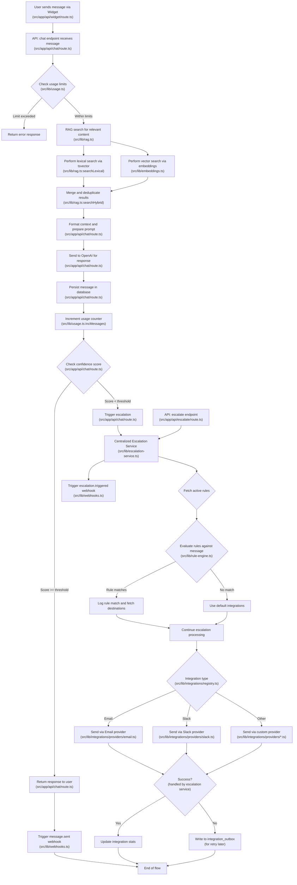

````markdown
# User Message Flow (2023 Update)

This document outlines the complete flow of a user message in the helpNINJA system, from initial submission in the widget through processing, RAG search, response generation, and potential escalation paths. This version reflects the 2023 architectural updates with the centralized escalation service.

## Message Flow Diagram



## Detailed Explanation

### Initial Request Processing
1. **Widget Interaction**: User sends a message via the embedded chat widget (`src/app/api/widget/route.ts`)
2. **API Endpoint**: `/api/chat` receives the message with `tenantId`, `sessionId`, and message content (`src/app/api/chat/route.ts`)
3. **Usage Validation**: System checks if tenant has remaining message quota via `canSendMessage` (`src/lib/usage.ts`)

### RAG (Retrieval Augmented Generation)
4. **Search Process**: The system performs hybrid search combining (`src/lib/rag.ts`):
   - **Lexical Search**: Uses PostgreSQL's tsvector for text matching (`searchLexical`)
   - **Vector Search**: Uses embeddings to find semantically similar content (`src/lib/embeddings.ts`)
5. **Results Processing**: Merges both search types and deduplicates by URL (`searchHybrid`)

### Response Generation
6. **Context Formation**: Formats retrieved documents into context for the LLM (`src/app/api/chat/route.ts`)
7. **OpenAI Request**: Sends formatted prompt with context to OpenAI (`src/app/api/chat/route.ts`)
8. **Persistence**: Stores the conversation message pair in the database (`src/app/api/chat/route.ts`)
9. **Usage Tracking**: Increments the tenant's message counter (`src/lib/usage.ts:incMessages`)

### Confidence Assessment
10. **Threshold Check**: Evaluates if the confidence score meets minimum threshold (0.55) (`src/app/api/chat/route.ts`)
11. **Below Threshold**: If confidence is low, triggers escalation flow via the escalation service (`src/app/api/chat/route.ts`)
12. **Above Threshold**: If confidence is acceptable, returns response to user (`src/app/api/chat/route.ts`)

### Escalation Flow (Updated Architecture)
13. **Centralized Service**: All escalation handling is now managed by a centralized service (`src/lib/escalation-service.ts`)
14. **Entry Points**: The service can be called from:
    - Chat API when confidence is low or rule matches (`src/app/api/chat/route.ts`)
    - Escalate API for direct escalation requests (`src/app/api/escalate/route.ts`)
    - Webhooks system when processing webhook events (`src/lib/webhooks.ts`)
15. **Rule Evaluation**: The service handles fetching and evaluation of rules:
    - Fetches active escalation rules for the tenant
    - Evaluates rules against the message context (`src/lib/rule-engine.ts`)
    - Rules are checked in priority order (highest first)
16. **Webhooks Management**: The service manages webhook triggering to prevent duplicates
17. **Destination Resolution**: The service resolves destinations from:
    - Matched rule destinations
    - Direct integration specification
    - Tenant default integrations

### Integration Dispatch
18. **Provider Selection**: Routes to appropriate integration provider (`src/lib/integrations/registry.ts`)
19. **Delivery Attempt**: Attempts to deliver the escalation via selected provider (`src/lib/integrations/providers/*.ts`)
20. **Outcome Tracking**:
    - Success: Updates integration statistics
    - Failure: Writes to integration_outbox for retry

### Final Webhook Events
21. **Event Notifications**: Triggers appropriate webhooks for the entire process (`src/lib/webhooks.ts`):
    - `message.sent` when assistant responds
    - `escalation.triggered` when escalation begins
    - `rule.matched` when a specific rule matches

## Common Issues and Troubleshooting
- **Missing Webhooks**: Ensure webhook endpoints are properly configured and active
- **Failed Escalations**: Check integration configuration and credentials
- **Rule Matching Problems**: Verify rule conditions are correctly formatted
- **Integration Format Mismatch**: Ensure destination format uses the expected field names (`integration_id` not `integrationId`)

This diagram and explanation cover the complete lifecycle of a user message in the helpNINJA system with the centralized escalation service architecture.
````
