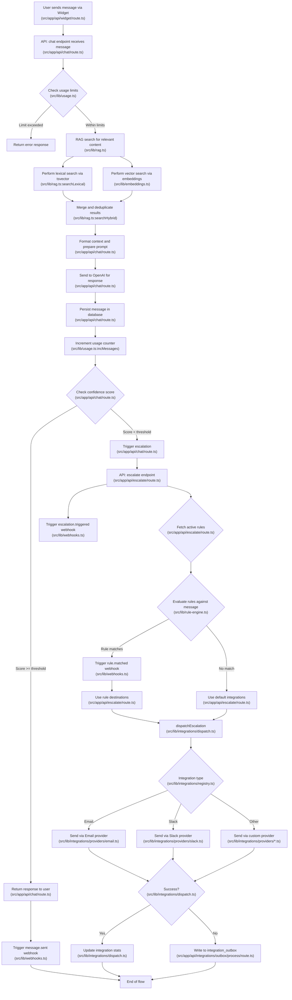

````markdown
# User Message Flow

This document outlines the complete flow of a user message in the helpNINJA system, from initial submission in the widget through processing, RAG search, response generation, and potential escalation paths.

## Message Flow Diagram



## Detailed Explanation

### Initial Request Processing
1. **Widget Interaction**: User sends a message via the embedded chat widget (`src/app/api/widget/route.ts`)
2. **API Endpoint**: `/api/chat` receives the message with `tenantId`, `sessionId`, and message content (`src/app/api/chat/route.ts`)
3. **Usage Validation**: System checks if tenant has remaining message quota via `canSendMessage` (`src/lib/usage.ts`)

### RAG (Retrieval Augmented Generation)
4. **Search Process**: The system performs hybrid search combining (`src/lib/rag.ts`):
   - **Lexical Search**: Uses PostgreSQL's tsvector for text matching (`searchLexical`)
   - **Vector Search**: Uses embeddings to find semantically similar content (`src/lib/embeddings.ts`)
5. **Results Processing**: Merges both search types and deduplicates by URL (`searchHybrid`)

### Response Generation
6. **Context Formation**: Formats retrieved documents into context for the LLM (`src/app/api/chat/route.ts`)
7. **OpenAI Request**: Sends formatted prompt with context to OpenAI (`src/app/api/chat/route.ts`)
8. **Persistence**: Stores the conversation message pair in the database (`src/app/api/chat/route.ts`)
9. **Usage Tracking**: Increments the tenant's message counter (`src/lib/usage.ts:incMessages`)

### Confidence Assessment
10. **Threshold Check**: Evaluates if the confidence score meets minimum threshold (0.55) (`src/app/api/chat/route.ts`)
11. **Below Threshold**: If confidence is low, triggers escalation flow (`src/app/api/chat/route.ts`)
12. **Above Threshold**: If confidence is acceptable, returns response to user (`src/app/api/chat/route.ts`)

### Escalation Flow
13. **Rule Evaluation** (`src/app/api/escalate/route.ts`): 
    - Fetches active escalation rules for the tenant
    - Evaluates each rule against the message context (`src/lib/rule-engine.ts`)
    - Rules are checked in priority order (highest first)
14. **Webhooks**: Triggers `escalation.triggered` webhook event (`src/lib/webhooks.ts`)
15. **Rule Matching**:
    - If a rule matches, triggers `rule.matched` webhook (`src/lib/webhooks.ts`)
    - Uses the rule's configured destinations for escalation

### Integration Dispatch
16. **Provider Selection**: Routes to appropriate integration provider (`src/lib/integrations/registry.ts`)
17. **Delivery Attempt**: Attempts to deliver the escalation via selected provider (`src/lib/integrations/providers/*.ts`)
18. **Outcome Tracking** (`src/lib/integrations/dispatch.ts`):
    - Success: Updates integration statistics
    - Failure: Writes to integration_outbox for retry (`src/app/api/integrations/outbox/process/route.ts`)

### Final Webhook Events
19. **Event Notifications**: Triggers appropriate webhooks for the entire process (`src/lib/webhooks.ts`):
    - `message.sent` when assistant responds
    - `escalation.triggered` when escalation begins
    - `rule.matched` when a specific rule matches

## Common Issues and Troubleshooting
- **Missing Webhooks**: Ensure webhook endpoints are properly configured and active
- **Failed Escalations**: Check integration configuration and credentials
- **Rule Matching Problems**: Verify rule conditions are correctly formatted
- **Integration Format Mismatch**: Ensure destination format uses the expected field names (`integration_id` not `integrationId`)

This diagram and explanation cover the complete lifecycle of a user message in the helpNINJA system.
````
